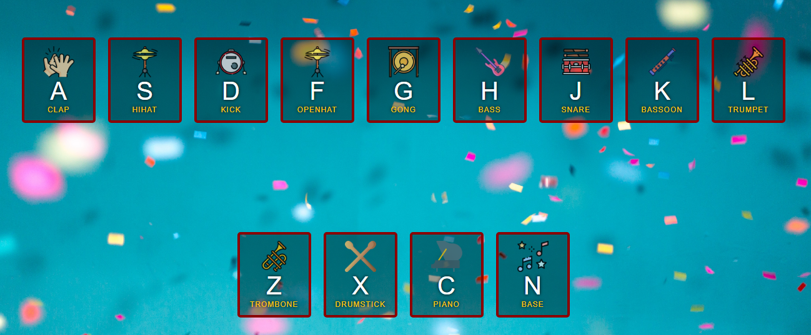

# DRUM KIT

**AUTOR: Mercedes Carballal**

Este proyecto consiste en un "drum kit" (kit de batería) con multiples teclas que permite al usuario tocar diferentes sonidos e instrumentos, con el mouse o ocn el teclado del ordenador. También he añadido una base para crear melodías a partir de algo más formado.
 

## Muestra

---

      <iframe width="560" height="315" src="./infoReadme/2020-11-10 Drum Kit.mp4" frameborder="0" allowfullscreen>
      </iframe>

 

## Estructura

Este proyecto está realizado con HTML, CSS y JavaScript.
