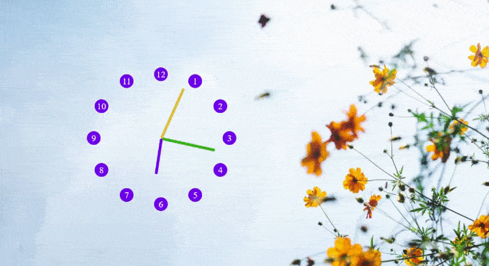

# CLOCK

**AUTOR: Mercedes Carballal**

Este proyecto consiste en construir un reloj con CSS y JavaScript
 

## Muestra

## Estructura

ℹ️ This project was based on one of Wes Bos' [JavaScript 30](https://javascript30.com/) challenges.
