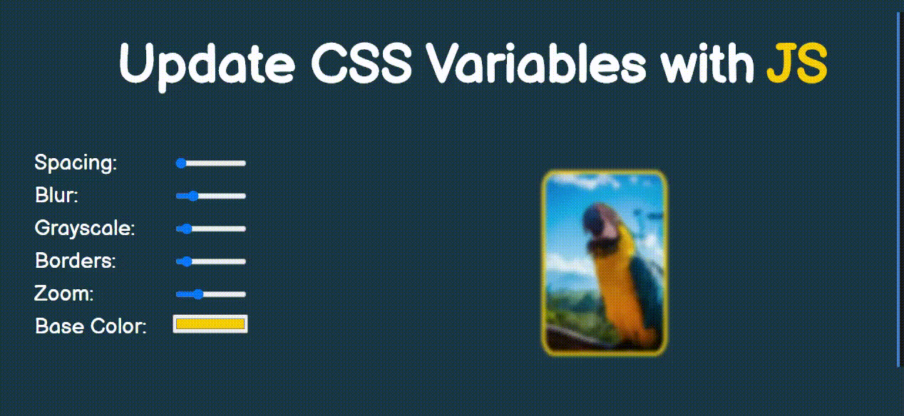

# CLOCK

**AUTOR: Mercedes Carballal**

Este proyecto consiste en construir un reloj con CSS y JavaScript
 

## Muestra

## Estructura

Este proyecto está realizado con HTML, CSS y JavaScript.

---

ℹ️ Este proyecto está basado en un reto de Wes Bos' [JavaScript 30](https://javascript30.com/).
