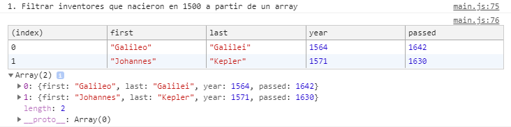
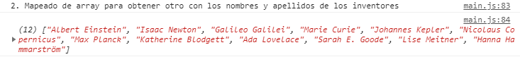
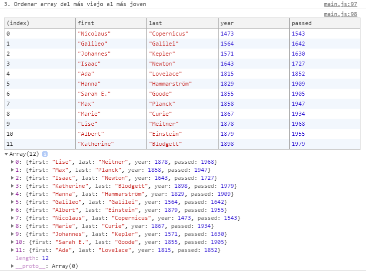
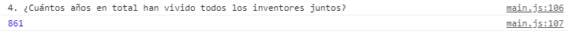
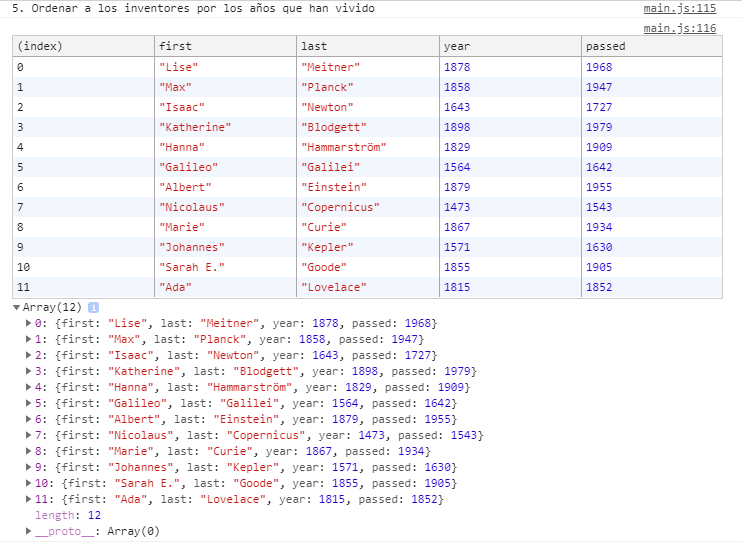
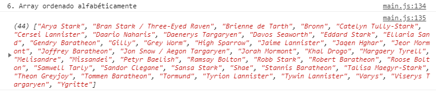
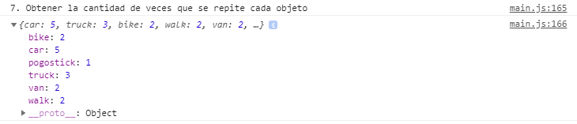

# Array Cardio

**AUTOR: Mercedes Carballal**

Este proyecto consiste en realizar operaciones con varios array utilizando JavaScript
<br >

## Operaciones realizadas:

Dados 2 array:

- Inventores
  ```js
  const inventors = [
    { first: 'Albert', last: 'Einstein', year: 1879, passed: 1955 },
    { first: 'Isaac', last: 'Newton', year: 1643, passed: 1727 },
    { first: 'Galileo', last: 'Galilei', year: 1564, passed: 1642 },
    { first: 'Marie', last: 'Curie', year: 1867, passed: 1934 },
    { first: 'Johannes', last: 'Kepler', year: 1571, passed: 1630 },
    { first: 'Nicolaus', last: 'Copernicus', year: 1473, passed: 1543 },
    { first: 'Max', last: 'Planck', year: 1858, passed: 1947 },
    { first: 'Katherine', last: 'Blodgett', year: 1898, passed: 1979 },
    { first: 'Ada', last: 'Lovelace', year: 1815, passed: 1852 },
    { first: 'Sarah E.', last: 'Goode', year: 1855, passed: 1905 },
    { first: 'Lise', last: 'Meitner', year: 1878, passed: 1968 },
    { first: 'Hanna', last: 'Hammarström', year: 1829, passed: 1909 },
  ];
  ```
- Personas
  ```js
  const people = [
    'Eddard Stark',
    'Robert Baratheon',
    'Jaime Lannister',
    'Catelyn Tully-Stark',
    'Cersei Lannister',
    'Daenerys Targaryen',
    'Jorah Mormont',
    'Viserys Targaryen',
    'Jon Snow / Aegon Targaryen',
    'Robb Stark',
    'Sansa Stark',
    'Arya Stark',
    'Theon Greyjoy',
    'Bran Stark / Three-Eyed Raven',
    'Joffrey Baratheon',
    'Sandor Clegane',
    'Tyrion Lannister',
    'Khal Drogo',
    'Petyr Baelish',
    'Davos Seaworth',
    'Samwell Tarly',
    'Stannis Baratheon',
    'Melisandre',
    'Jeor Mormont',
    'Bronn',
    'Varys',
    'Shae',
    'Margaery Tyrell',
    'Tywin Lannister',
    'Talisa Maegyr-Stark',
    'Ygritte',
    'Gendry Baratheon',
    'Tormund',
    'Brienne de Tarth',
    'Ramsay Bolton',
    'Gilly',
    'Daario Naharis',
    'Missandei',
    'Ellaria Sand',
    'Tommen Baratheon',
    'Jaqen Hghar',
    'Roose Bolton',
    'High Sparrow',
    'Grey Worm',
  ];
  ```

**1. Filtrar inventores que nacieron en 1500 a partir de un array**

Utilizo el método de array `filter` y a la función le indicos el rango en el que tiene que filtrar:

```js
const fifteen = inventors.filter(
  (inventor) => inventor.year >= 1500 && inventor.year < 1600
);

console.table(
  '1. Filtrar inventores que nacieron en 1500 a partir de un array'
);
console.table(fifteen);
```



**2. Mapeado de array para obtener otro con los nombres y apellidos de los inventores**

Utilizo el método de array `map` indicándole que quiero un array del mismo tamaño pero solo con el nombre y apellido de cada inventor:

```js
const fullNames = inventors.map(
        (inventor) => `${inventor.first} ${inventor.last}`
      );
      console.log('2. Mapeado de array para obtener otro con los nombres y apellidos de los inventores');
      console.log(fullNames);
```



**3. Ordenar array del más viejo al más joven**

Utilizo el método de array `sort` indicándole que quiero el array ordenado de mayor a menor, uso un ternario para decirle que **si a es mayor que b = 1, y sino = -1**:



**4. ¿Cuántos años en total han vivido todos los inventores juntos?**



**5. Ordenar a los inventores por los años que han vivido**



**6. Array ordenado alfabéticamente**



**7. Obtener la cantidad de veces que se repite cada objeto**



## Estructura

Este proyecto está realizado con JavaScript.

---

ℹ️ Este proyecto está basado en un reto de Wes Bos' [JavaScript 30](https://javascript30.com/).
