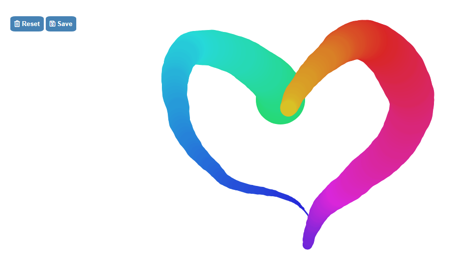

# Fun with HTML 5 Canvas

**AUTOR: Mercedes Carballal**



Este proyecto consiste en realizar un canvas(lienzo) en el que pinzar unos trazos con la apariencia de pincel, que a medida que vamos pintando cambien de dimensión.

Además he añadido un botón **Reset** para volver a empezar el dibujo y un botón **Save** para guardar el resultado en pdf.

<br >

## Muestra


## Resolución

Comenzamos indicando el valor que representa un contexto de reperesentación bidimensional

```js
const ctx = canvas.getContext('2d');
```

Indicamos las dimensiones que va a ocupar el canvas

```js
canvas.width = window.innerWidth;
canvas.height = window.innerHeight;
```

Indicamos los estipos por defecto que vamos a darle al contexto 2D

```js
ctx.strokeStyle = '#BADA55';
ctx.lineJoin = 'round';
ctx.lineCap = 'round';
ctx.lineWidth = 100;
```

Definimos las variables que van a cambiar

```js
let isDrawing = false;
let lastX = 0; //Coordenada X inicial
let lastY = 0; //Coordenada Y inicial
let hue = 145; //Color hue inicial
let direction = true;
```

Función que permitirá realizar el dibujo 2D

```js
function draw(e) {
  if (!isDrawing) return; // Paramos la funcion cuando no estamos clickando el ratón

  ctx.strokeStyle = `hsl(${hue}, 70%, 50%)`;
  ctx.save();
  ctx.beginPath();
  ctx.moveTo(lastX, lastY); // Indicamos desde donde empieza
  ctx.lineTo(e.offsetX, e.offsetY); // Indicamos hasta donde termina
  ctx.stroke();
  [lastX, lastY] = [e.offsetX, e.offsetY];

  //Valores de gama de color entre los que va a variar el trazo
  hue++;
  if ((hue >= 320) & (hue < 145)) {
    hue = 145;
  }

  //Valores de tamaño entre los que va a variar el trazo
  if (ctx.lineWidth >= 100 || ctx.lineWidth <= 1) {
    direction = !direction;
  }

  //Valores de dirección entre los que va a variar el trazo
  if (direction) {
    ctx.lineWidth++;
  } else {
    ctx.lineWidth--;
  }
}
```

Como ya he mencionado yo he añadido dos botones: **reset** y **save**

```js
function reset() {
  location.reload();
}

function save() {
  // only jpeg is supported by jsPDF
  var imgData = canvas.toDataURL('image/jpeg', 1.0);
  var pdf = new jsPDF('landscape');

  pdf.addImage(imgData, 'JPEG', 0, 0, 300, 210);
  pdf.save('download.pdf');
}
```

## Estructura

Este proyecto está realizado con JavaScript.

---

ℹ️ Este proyecto está basado en un reto de Wes Bos' [JavaScript 30](https://javascript30.com/).
