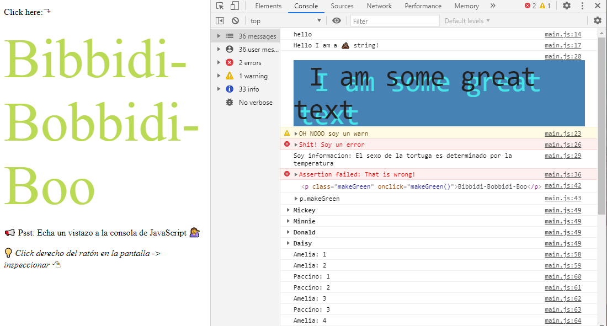
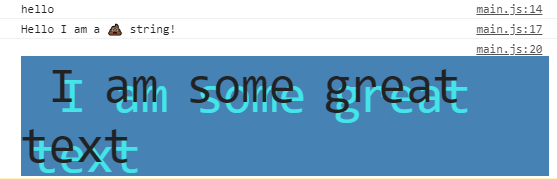
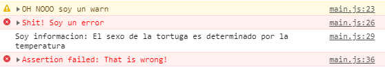
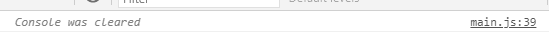
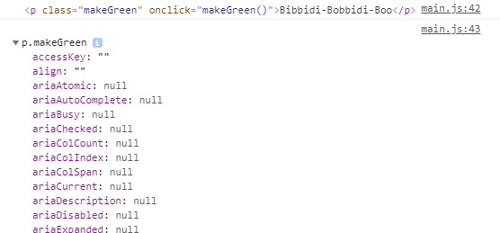
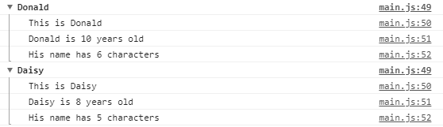
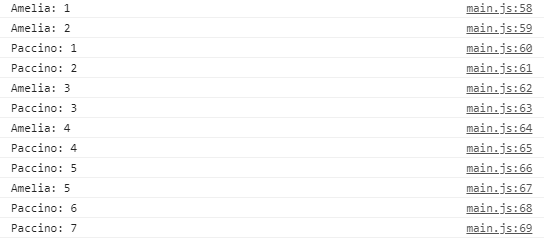
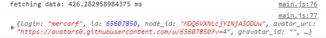
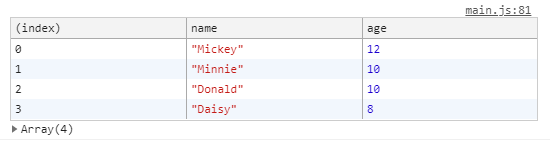

# Dev Tools Domination

**AUTOR: Mercedes Carballal**



Este proyecto muestra algunos trucos de los Dev Tools de Google.

<br >

## Resolución

1. Manera básica/regular de mostrar un mensaje en la consola

```js
console.log('hello');
```

2. Mostrar mensaje interpolando (%s)

```js
console.log('Hello I am a %s string!', '💩');
```

3. Mostrar estilos CSS en consola (%c)

```js
console.log(
  '%c I am some great text',
  'font-size:50px; background:steelblue; text-shadow: 10px 10px 0 #44e4e9'
);
```

**_Imagen de los puntos 1,2 y 3_**



4. mostrar warning!

```js
console.warn('OH NOOO soy un warn');
```

5. Mostrar Error :|

```js
console.error('Shit! Soy un error');
```

6. Mostrar Info

```js
console.info(
  'Soy informacion: El sexo de la tortuga es determinado por la temperatura'
);
```

7. Testeo que la clase del elemento seleccionado contenga 'ouch'

```js
const p = document.querySelector('.ouch');
const magic = document.querySelector('.makeGreen');

console.assert(p.classList.contains('ouch'), 'That is wrong!'); //De este mensaje no sale error ya que cumple el test
console.assert(magic.classList.contains('ouch'), 'That is wrong!');
```

**_Imagen de los puntos 4,5,6 y 7_**



8. Limpiar la consola

```js
console.clear();
```



9. Visualizando elementos del DOM

```js
console.log(magic); //muestra el elemento indicado
console.dir(magic); //muestra las propiedades del elemento indicado
```



10. Dado un array de personajes:

```js
const characters = [
  { name: 'Mickey', age: 12 },
  { name: 'Minnie', age: 10 },
  { name: 'Donald', age: 10 },
  { name: 'Daisy', age: 8 },
];
```

Agrupamos cada personaje con su información

```js
characters.forEach((character) => {
  console.groupCollapsed(`${character.name}`);
  console.log(`This is ${character.name}`);
  console.log(`${character.name} is ${character.age} years old`);
  console.log(`His name has ${character.name.length} characters`);
  console.groupEnd(`${character.name}`);
});
```



11. Contar las veces que se repiten los nombres

```js
console.count('Amelia');
console.count('Amelia');
console.count('Paccino');
console.count('Paccino');
console.count('Amelia');
console.count('Paccino');
console.count('Amelia');
console.count('Paccino');
console.count('Paccino');
console.count('Amelia');
console.count('Paccino');
console.count('Paccino');
```



12. Tiempo de respuesta

```js
console.time('fetching data');
fetch('https://api.github.com/users/mercarf')
  .then((data) => data.json())
  .then((data) => {
    console.timeEnd('fetching data');
    console.log(data);
  });
```



13. Mostrar tabla a partir del array de personajes:

```js
console.table(characters);
```



## Estructura

Este proyecto está realizado con JavaScript.

---

ℹ️ Este proyecto está basado en un reto de Wes Bos' [JavaScript 30](https://javascript30.com/).

```

```
