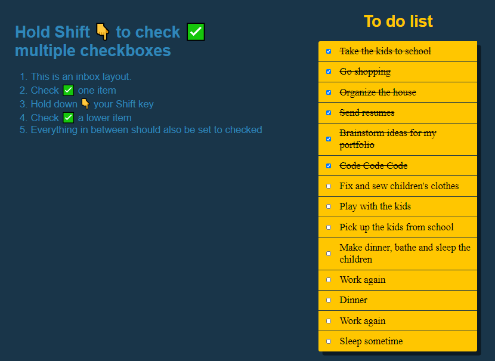
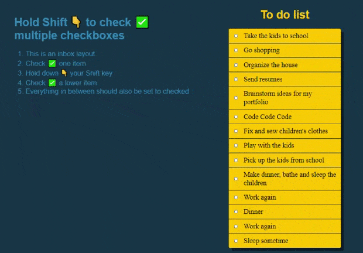

# Dev Tools Domination

**AUTOR: Mercedes Carballal**



Este proyecto consiste en crear la funcionalidad de marcar varias casillas a la vez manteniendo pulsada la tecla shift.

<br >

## Muestra



## Resolución

Con la ayuda de JS creamos una constante/array seleccionando todos los checkboxes y creamos una variable **lastChecked**

```js
const checkboxes = document.querySelectorAll('.inbox input[type="checkbox"]');

let lastChecked;
```

Creamos una función manejadora de los checkboxes, que identificará cuales son los checkboxes que se encuentran en medio de los dos seleccionados. Y con ayuda del CSS además de dejarlos marcados, los tachamos.

```js
function handleCheck(e) {
  let inBetween = false;
  if (e.shiftKey && this.checked) {
    // Bucle que recorre cada checkbox
    checkboxes.forEach((checkbox) => {
      if (checkbox === this || checkbox === lastChecked) {
        inBetween = !inBetween;
      }

      if (inBetween) {
        checkbox.checked = true;
      }
    });
  }

  lastChecked = this;
}
```

## Estructura

Este proyecto está realizado con HTML, CSS y JavaScript.

---

ℹ️ Este proyecto está basado en un reto de Wes Bos' [JavaScript 30](https://javascript30.com/).
