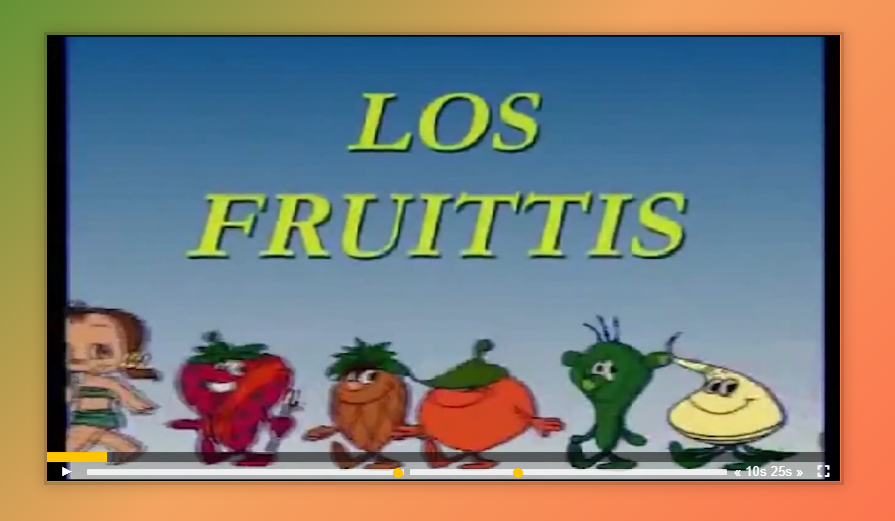

# Custom Video Player

**AUTOR: Mercedes Carballal**



Este proyecto consiste en crear la funcionalidad de un reproductor de video, con botones de play, pausa, avanza 25 segundos, retrocede 10 segundos, expande a pantalla completa, etc..

<br >

## Muestra


## Resolución

```js
***;
```

## Estructura

Este proyecto está realizado con HTML, CSS y JavaScript.

---

ℹ️ Este proyecto está basado en un reto de Wes Bos' [JavaScript 30](https://javascript30.com/).
