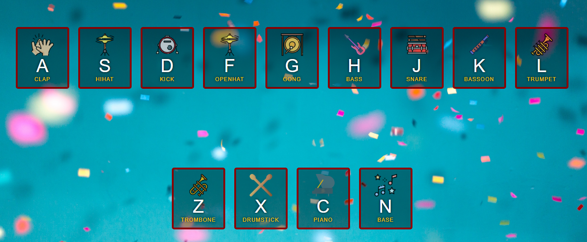
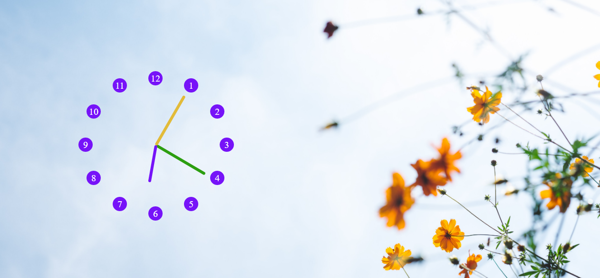
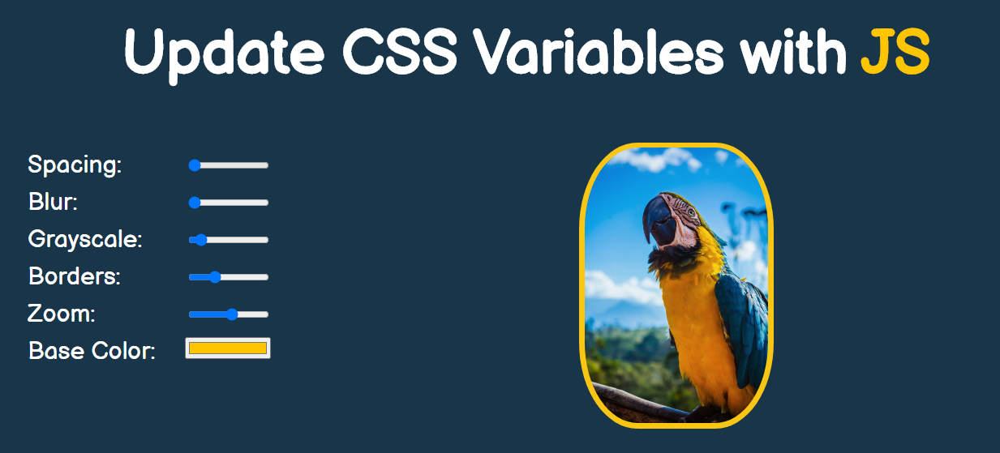
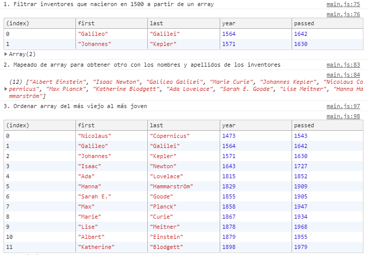

# JavaScript30

ℹ️ Este repositorio es un reto de Wes Bos' [JavaScript 30](https://javascript30.com/) que he ido personalizando a mi gusto.

## Vista general de los retos

| 10 Retos                                                                                                      | 10 Retos                             | 10 Retos                                          |
| ------------------------------------------------------------------------------------------------------------- | ------------------------------------ | ------------------------------------------------- |
| 1. [JavaScript Drum Kit](https://github.com/mercarf/JavaScript30/tree/main/01-DrumKit)                        | 11. Custom Video PLayer              | 21. Geolocation                                   |
|                       | ---                                  | ---                                               |
| 2. [JS and CSS Clock](https://github.com/mercarf/JavaScript30/tree/main/02-Clockt)                            | 12. Key Sequence Detection           | 22. Follow Along Link Higlighter                  |
|                                 | ---                                  | ---                                               |
| 3. [CSS Variables](https://github.com/mercarf/JavaScript30/tree/main/03-CSSVariables)                         | 13. Slide in on Scroll               | 23. Speech Synthesis                              |
|           | ---                                  | ---                                               |
| 4. [Array Cardio Day 1](https://github.com/mercarf/JavaScript30/tree/main/04-ArrayCardio1)                    | 14. JavaScript References vs Copying | 24. Stiky Nav                                     |
|                | ---                                  | ---                                               |
| 5. [Flex Panel Gallery](https://github.com/mercarf/JavaScript30/tree/main/05-FlexPanelGallery)                | 15. LocalStorage                     | 25. Event Capture, Propagation, Bubbling and Once |
|  | ---                                  | ---                                               |
| 6. Type Ahead                                                                                                 | 16. Mouse Move Shadow                | 26. Stripe Follow Along Nav                       |
| ---                                                                                                           | ---                                  | ---                                               |
| 7. Array Cardio Day 2                                                                                         | 17. Sort without Articles            | 27. Click and Drag                                |
| ---                                                                                                           | ---                                  | ---                                               |
| 8. [Fun with HTML5 Canvas](https://github.com/mercarf/JavaScript30/tree/main/08-FunHtml5Canvas)               | 18. Adding Yo Tunes with Reduce      | 28. Video Speed Controller                        |
|       | ---                                  | ---                                               |
| 9. Dev Tools Domination                                                                                       | 19. Webcam Fun                       | 29. Countdown Timer                               |
| ---                                                                                                           | ---                                  | ---                                               |
| 10. Hold Shift and Check Checkboxes                                                                           | 20. Speech Detection                 | 30. Whack a Mole                                  |
| ---                                                                                                           | ---                                  | ---                                               |
