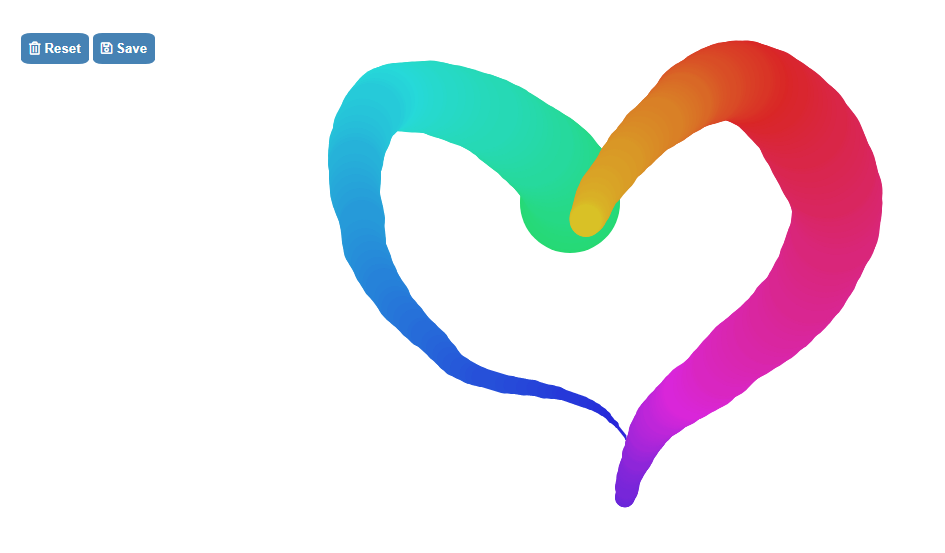
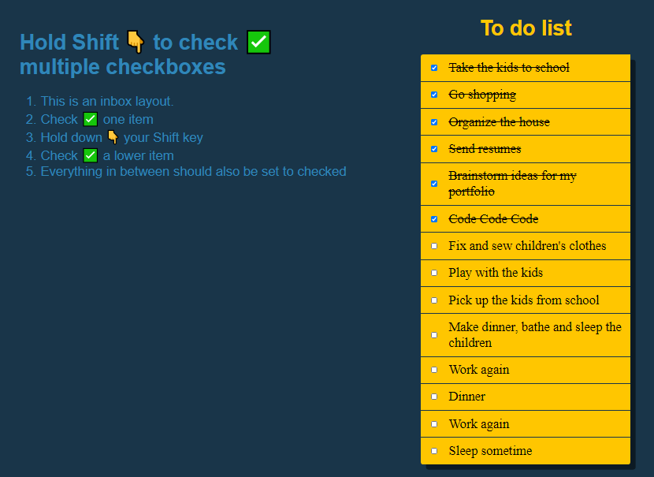

# JavaScript30

ℹ️ Este repositorio es un reto de Wes Bos' [JavaScript 30](https://javascript30.com/) que he ido personalizando a mi gusto.

## Vista general de los retos

<table>
    <colgroup>
        <col span="1" style="width: 50%;">
        <col span="1" style="width: 50%;">
    </colgroup>
    <tr>
        <td align="center"><strong>01-10 Retos</strong></td>
        <td align="center"><strong>11-20 Retos</strong></td>
        <td align="center"><strong>21-30 Retos</strong></td>
    </tr>
    <tr>
        <td align="center">
            <a href="https://github.com/mercarf/JavaScript30/tree/main/01-DrumKit">1. JavaScript Drum Kit</a>
        </td>
        <td align="center"> 
            <a href="https://github.com/mercarf/JavaScript30/tree/main/11-CustomVideoPlayer">11. Custom Video PLayer</a>
        </td>
        <td align="center"> 
            
21. Geolocation

        </td>
    </tr>
    <tr>
        <td align="center"></td>
        <td align="center"></td>
        <td align="center">
---
</td>
    </tr>
    <tr>
        <td align="center">
            <a href="https://github.com/mercarf/JavaScript30/tree/main/02-Clock">2. JS and CSS Clock</a>
        </td>
        <td align="center">
    	    
12. Key Sequence Detection

        </td>
        <td align="center">
    	    
22. Follow Along Link Higlighter

        </td>
    </tr>
    <tr>
        <td align="center"></td>
        <td align="center">
---
</td>
        <td align="center">
---
</td>
    </tr>
    <tr>
        <td align="center">
            <a href="https://github.com/mercarf/JavaScript30/tree/main/03-CSSVariables">3. CSS Variables</a>
        </td>
        <td align="center">
    	    
13. Slide in on Scroll

        </td>
        <td align="center">
    	    
23. Speech Synthesis

        </td>
    </tr>
    <tr>
        <td align="center"></td>
        <td align="center">
---
</td>
        <td align="center">
---
</td>
    </tr>
    <tr>
        <td align="center">
            <a href="https://github.com/mercarf/JavaScript30/tree/main/04-ArrayCardio1">4. Array Cardio Day 1</a>
        </td>
        <td align="center">
    	    
14. JavaScript References vs Copying

        </td>
        <td align="center">
    	    
24. Stiky Nav

        </td>
    </tr>
    <tr>
        <td align="center"></td>
        <td align="center">
---
</td>
        <td align="center">
---
</td>
    </tr>
    <tr>
        <td align="center">
            <a href="https://github.com/mercarf/JavaScript30/tree/main/05-FlexPanelGallery">4. Array Cardio Day 1</a>
        </td>
        <td align="center">
    	    
15. LocalStorage

        </td>
        <td align="center">
    	    
25. Event Capture, Propagation, Bubbling and Once

        </td>
    </tr>
    <tr>
        <td align="center"></td>
        <td align="center">
---
</td>
        <td align="center">
---
</td>
    </tr>
    <tr>
        <td align="center">
            
6. Type Ahead

        </td>
        <td align="center">
    	    
16. Mouse Move Shadow

        </td>
        <td align="center">
    	    
26. Stripe Follow Along Nav

        </td>
    </tr>
    <tr>
        <td align="center">
---
</td>
        <td align="center">
---
</td>
        <td align="center">
---
</td>
    </tr>
    <tr>
        <td align="center">
            
7. Array Cardio Day 2

        </td>
        <td align="center">
    	    
17. Sort without Articles

        </td>
        <td align="center">
    	    
27. Click and Drag

        </td>
    </tr>
    <tr>
        <td align="center">
---
</td>
        <td align="center">
---
</td>
        <td align="center">
---
</td>
    </tr>
    <tr>
        <td align="center">
            <a href="https://github.com/mercarf/JavaScript30/tree/main/08-FunHtml5Canvas">8. Fun with HTML5 Canvas</a>
        </td>
        <td align="center">
    	    
18. Adding Yo Tunes with Reduce

        </td>
        <td align="center">
    	    
28. Video Speed Controller

        </td>
    </tr>
    <tr>
        <td align="center"></td>
        <td align="center">
---
</td>
        <td align="center">
---
</td>
    </tr>
    <tr>
        <td align="center">
            <a href="https://github.com/mercarf/JavaScript30/tree/main/09-DevTools">9. Dev Tools Domination</a>
        </td>
        <td align="center">
    	    
19. Webcam Fun

        </td>
        <td align="center">
    	    
29. Countdown Timer

        </td>
    </tr>
    <tr>
        <td align="center"></td>
        <td align="center">
---
</td>
        <td align="center">
---
</td>
    </tr>
    <tr>
        <td align="center">
            <a href="https://github.com/mercarf/JavaScript30/tree/main/10-HoldShiftCheck">10. Hold Shift and Check Checkboxes</a>
        </td>
        <td align="center">
    	    
20. Speech Detection

        </td>
        <td align="center">
    	    
30. Whack a Mole

        </td>
    </tr>
    <tr>
        <td align="center"></td>
        <td align="center">
---
</td>
        <td align="center">
---
</td>
    </tr>
</table>
