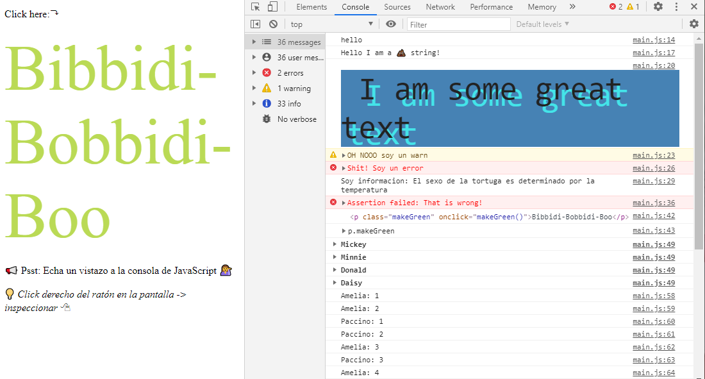

# JavaScript30

ℹ️ Este repositorio es un reto de Wes Bos' [JavaScript 30](https://javascript30.com/) que he ido personalizando a mi gusto.

## Vista general de los retos

<table>
    <colgroup>
        <col span="1" style="width: 50%;">
        <col span="1" style="width: 50%;">
    </colgroup>
    <tr>
        <td><strong>01-10 Retos</strong></td>
        <td><strong>11-20 Retos</strong></td>
        <td><strong>21-30 Retos</strong></td>
    </tr>
    <tr>
        <td>
            <a href="https://github.com/mercarf/JavaScript30/tree/main/01-DrumKit">1. JavaScript Drum Kit</a>
        </td>
        <td> 
            <a href="">11. Custom Video PLayer</a>
        </td>
        <td> 
            <a href="">21. Geolocation</a>
        </td>
    </tr>
    <tr>
        <td></td>
        <td>
---
</td>
        <td>
---
</td>
    </tr>
    <tr>
        <td>
            <a href="https://github.com/mercarf/JavaScript30/tree/main/02-Clock">2. JS and CSS Clock</a>
        </td>
        <td>
    	    <a href="4">12. Key Sequence Detection</a>
        </td>
        <td>
    	    <a href="">22. Follow Along Link Higlighter</a>
        </td>
    </tr>
    <tr>
        <td></td>
        <td>
---
</td>
        <td>
---
</td>
    </tr>
    <tr>
        <td>
            <a href="https://github.com/mercarf/JavaScript30/tree/main/03-CSSVariables">3. CSS Variables</a>
        </td>
        <td>
    	    <a href="4">13. Slide in on Scroll</a>
        </td>
        <td>
    	    <a href="">23. Speech Synthesis</a>
        </td>
    </tr>
    <tr>
        <td></td>
        <td>
---
</td>
        <td>
---
</td>
    </tr>
    <tr>
        <td>
            <a href="https://github.com/mercarf/JavaScript30/tree/main/04-ArrayCardio1">4. Array Cardio Day 1</a>
        </td>
        <td>
    	    <a href="4">14. JavaScript References vs Copying</a>
        </td>
        <td>
    	    <a href="">24. Stiky Nav</a>
        </td>
    </tr>
    <tr>
        <td></td>
        <td>
---
</td>
        <td>
---
</td>
    </tr>
    <tr>
        <td>
            <a href="https://github.com/mercarf/JavaScript30/tree/main/05-FlexPanelGallery">4. Array Cardio Day 1</a>
        </td>
        <td>
    	    <a href="4">15. LocalStorage</a>
        </td>
        <td>
    	    <a href="">25. Event Capture, Propagation, Bubbling and Once</a>
        </td>
    </tr>
    <tr>
        <td></td>
        <td>
---
</td>
        <td>
---
</td>
    </tr>
    <tr>
        <td>
            <a href="">6. Type Ahead</a>
        </td>
        <td>
    	    <a href="4">16. Mouse Move Shadow</a>
        </td>
        <td>
    	    <a href="">26. Stripe Follow Along Nav</a>
        </td>
    </tr>
    <tr>
        <td>
---
</td>
        <td>
---
</td>
        <td>
---
</td>
    </tr>
    <tr>
        <td>
            <a href="">7. Array Cardio Day 2</a>
        </td>
        <td>
    	    <a href="4">17. Sort without Articles</a>
        </td>
        <td>
    	    <a href="">27. Click and Drag</a>
        </td>
    </tr>
    <tr>
        <td>
---
</td>
        <td>
---
</td>
        <td>
---
</td>
    </tr>
    <tr>
        <td>
            <a href="https://github.com/mercarf/JavaScript30/tree/main/08-FunHtml5Canvas">8. Fun with HTML5 Canvas</a>
        </td>
        <td>
    	    <a href="4">18. Adding Yo Tunes with Reduce</a>
        </td>
        <td>
    	    <a href="">28. Video Speed Controller</a>
        </td>
    </tr>
    <tr>
        <td></td>
        <td>
---
</td>
        <td>
---
</td>
    </tr>
    <tr>
        <td>
            <a href="https://github.com/mercarf/JavaScript30/tree/main/09-DevTools">9. Dev Tools Domination</a>
        </td>
        <td>
    	    <a href="4">19. Webcam Fun</a>
        </td>
        <td>
    	    <a href="">29. Countdown Timer</a>
        </td>
    </tr>
    <tr>
        <td></td>
        <td>
---
</td>
        <td>
---
</td>
    </tr>
    <tr>
        <td>
            <a href="">10. Hold Shift and Check Checkboxes</a>
        </td>
        <td>
    	    <a href="4">20. Speech Detection</a>
        </td>
        <td>
    	    <a href="">30. Whack a Mole</a>
        </td>
    </tr>
    <tr>
        <td></td>
        <td>
---
</td>
        <td>
---
</td>
    </tr>
</table>
